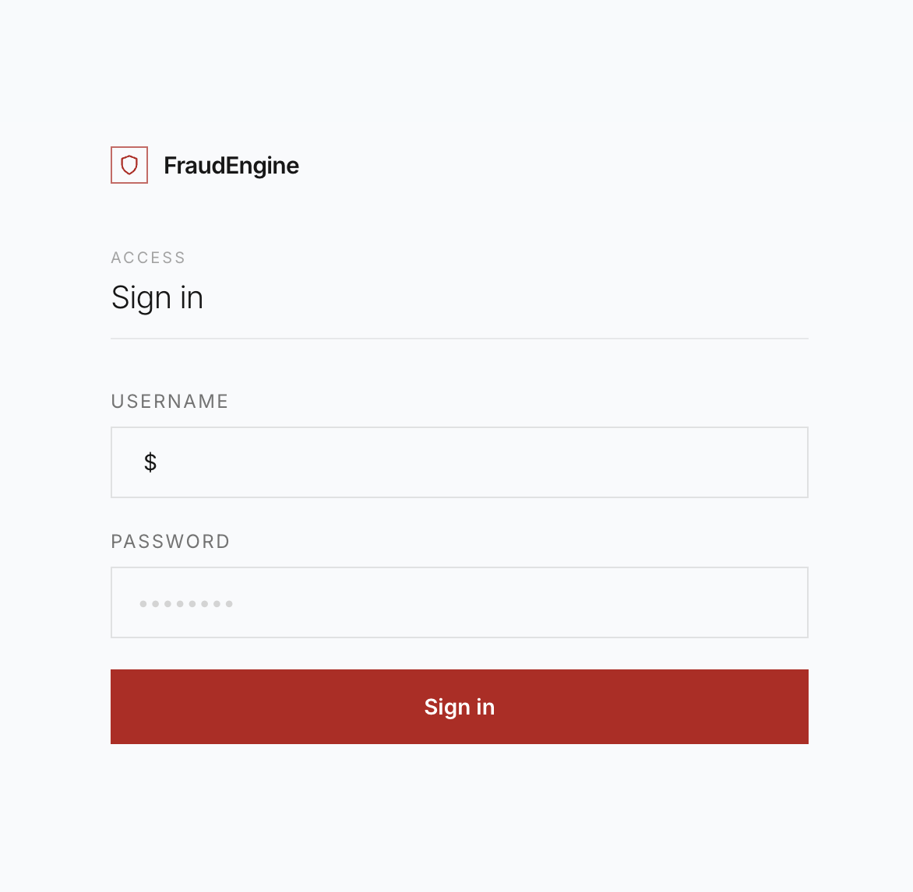
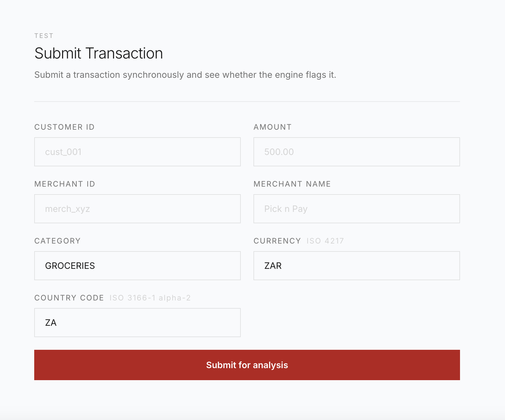
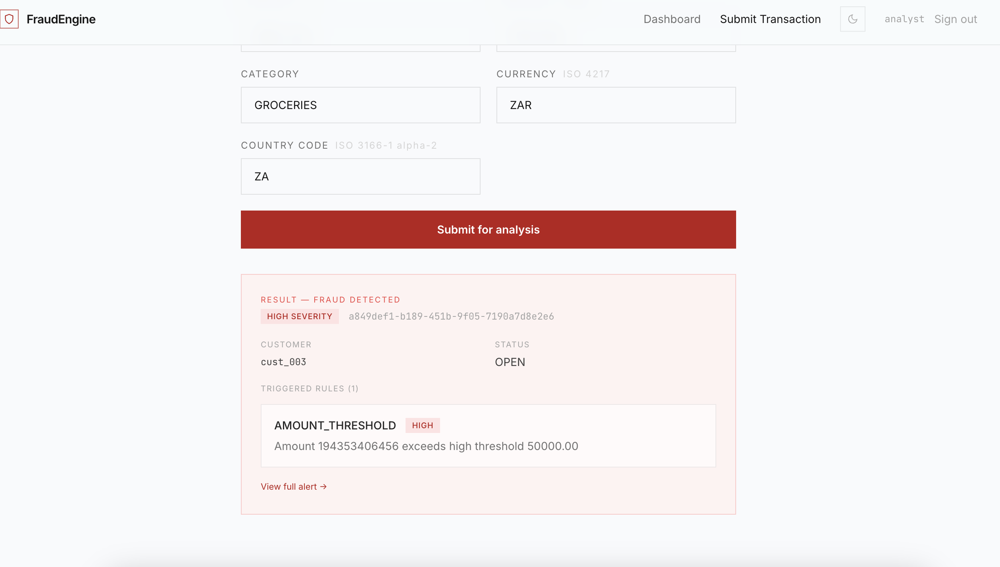
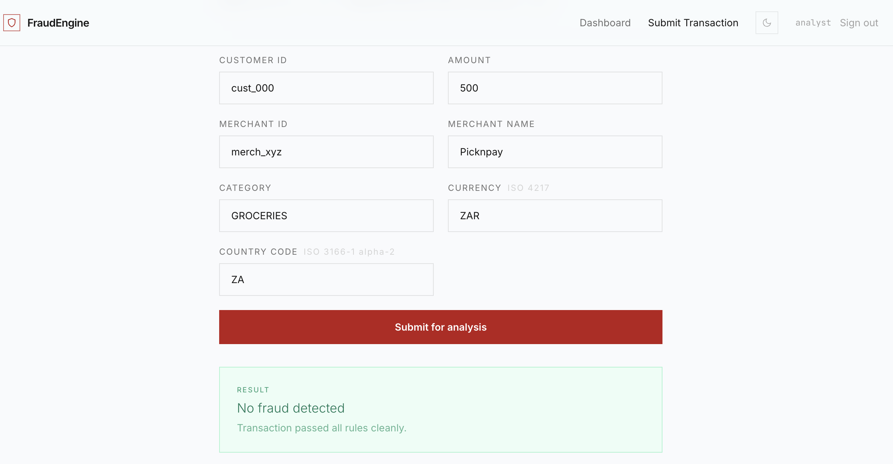
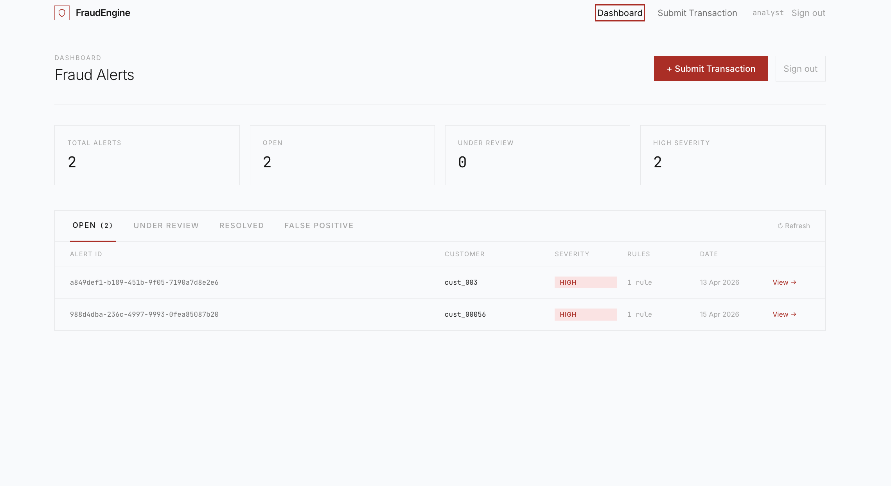
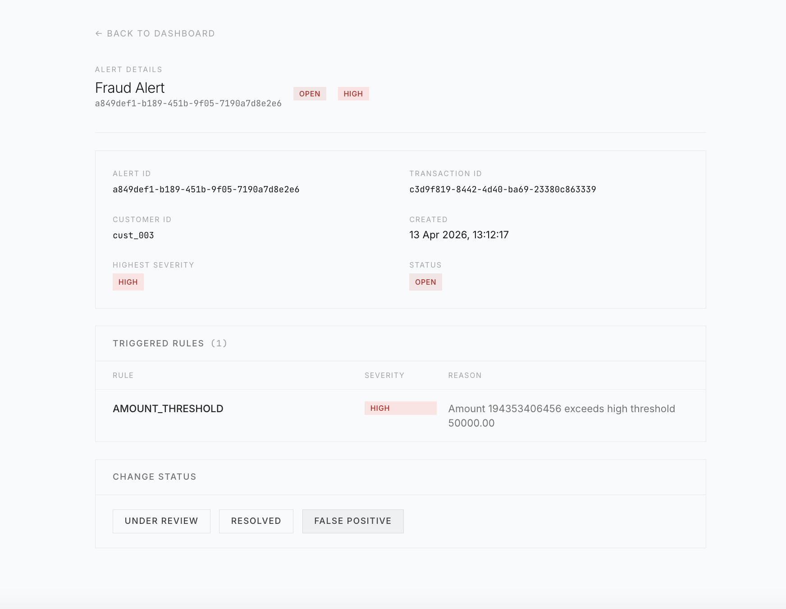

# Fraud Detection Engine — UI

A React + TypeScript dashboard for the [Fraud Detection Engine](https://github.com/kimbirk26/fraud-detection-engine) backend. Displays real-time fraud alerts, supports status filtering, and includes a transaction submission form for testing the synchronous evaluation endpoint.

## Screenshots













---

## Prerequisites

- **Node.js 20+**
- The **fraud-detection-engine** backend running on `http://localhost:8080`

---

## Running the Backend

From the `fraud-detection-engine` directory:

```bash
# Copy environment defaults (only needed once)
cp .env.example .env

# Start the app, Postgres, and Kafka
docker compose up --build
```

> **Without Kafka:** Start only Postgres, then run the app with the local profile:
>
> ```bash
> docker compose up postgres -d
> SPRING_PROFILES_ACTIVE=local ./mvnw spring-boot:run
> ```

The backend starts on `http://localhost:8080`. The local profile bootstraps three users automatically:

| Username           | Password        | Access                          |
| ------------------ | --------------- | ------------------------------- |
| `analyst`          | `analyst_pass`  | Submit transactions, all alerts |
| `admin`            | `admin_pass`    | Full access                     |
| `customer_cust001` | `customer_pass` | Own alerts only (`CUST001`)     |

Sign in to the UI with any of these credentials.

---

## Running the UI

```bash
# Copy environment variables (only needed once)
cp .env.example .env

npm install
npm run dev
```

The app starts at `http://localhost:5173`, which is already in the backend's CORS allowed origins.

The only required environment variable is:

| Variable            | Default                        | Description                                |
| ------------------- | ------------------------------ | ------------------------------------------ |
| `VITE_API_BASE_URL` | `http://localhost:8080/api/v1` | Base URL of the fraud-detection-engine API |

---

## Building for Production

```bash
npm run build
```

Output is written to `dist/`.

---

## Docker

### Run everything with one command

The UI is included as a service in the backend's `docker-compose.yml`. From the `fraud-detection-engine` directory:

```bash
cp .env.example .env
docker compose up --build
```

| Service | URL                     |
| ------- | ----------------------- |
| UI      | `http://localhost:3000` |
| Backend | `http://localhost:8080` |

The UI waits for the backend's `/actuator/health` endpoint to report `UP` before starting, so everything comes up in the right order.

### Build and run the UI container standalone

```bash
docker build -t fraud-detection-engine-ui .
docker run -p 3000:80 fraud-detection-engine-ui
```

> The UI calls the backend at `http://localhost:8080` from the user's browser, so the backend must be accessible on that port regardless of how the UI is run.

---

## Pages

| Route         | Description                                                            |
| ------------- | ---------------------------------------------------------------------- |
| `/login`      | Sign in with backend credentials                                       |
| `/dashboard`  | Alert list grouped by status, stat cards, auto-polls while alerts open |
| `/alerts/:id` | Full alert detail — triggered rules, severities, reasons               |
| `/submit`     | Submit a transaction synchronously and see the fraud result inline     |

---

## Architecture

### System context

The UI is the frontend layer of a larger distributed system:

```
Browser → React UI → Spring Boot API → PostgreSQL
                                     ↘ Kafka (optional)
```

Transactions can be submitted synchronously through the UI (immediate result) or ingested asynchronously via Kafka. The UI surfaces the resulting fraud alerts regardless of which path the transaction took.

### Key design decisions

**JWT decoded client-side**

On login the API returns a signed JWT. The UI decodes the payload in the browser (`src/auth/session.tsx`) to extract the user's ID and roles without making an additional `/me` request on every page load. The accepted trade-off is that role changes do not take effect until the token expires — standard behaviour for stateless JWT auth.

**Graceful degradation with `Promise.allSettled`**

The dashboard fetches alerts for each status (`OPEN`, `UNDER_REVIEW`, `RESOLVED`) in parallel. Using `Promise.allSettled` rather than `Promise.all` means a slow or failing status endpoint degrades the relevant tab rather than crashing the whole dashboard.

**Polling over WebSockets**

Live alert updates use a 10-second polling interval while open alerts exist. This was a deliberate pragmatic choice — polling requires no persistent connection or server-side infrastructure. Server-Sent Events or WebSockets would be the natural next step for a production deployment with high alert volume.

**Feature-based folder structure**

```
src/
  features/alerts/    ← alert-specific components co-located
  pages/              ← route-level components
  components/         ← shared/generic components
  hooks/              ← shared hooks
  lib/                ← API client, formatters, shared constants
  auth/               ← JWT parsing and session management
  config/             ← route constants, badge config
```

The intent is that each feature area owns its own components and logic. As the app grows, `features/` expands without polluting the shared `components/` directory.

**Centralised route constants**

All route strings live in `src/config/routes.ts` and are imported wherever a path is needed. A route rename is a one-line change with a compile-time guarantee that all consumers are updated.

---

## Tech Stack

### Frontend

|           |                                |
| --------- | ------------------------------ |
| Framework | React 18 + TypeScript (strict) |
| Build     | Vite                           |
| Styling   | Tailwind CSS                   |
| Routing   | React Router v6                |
| Testing   | Vitest + Testing Library       |
| Container | nginx (Alpine)                 |

### Backend (separate repo)

|           |                         |
| --------- | ----------------------- |
| Framework | Spring Boot 3           |
| Language  | Java                    |
| Database  | PostgreSQL              |
| Messaging | Kafka (optional)        |
| Auth      | JWT (signed, stateless) |
